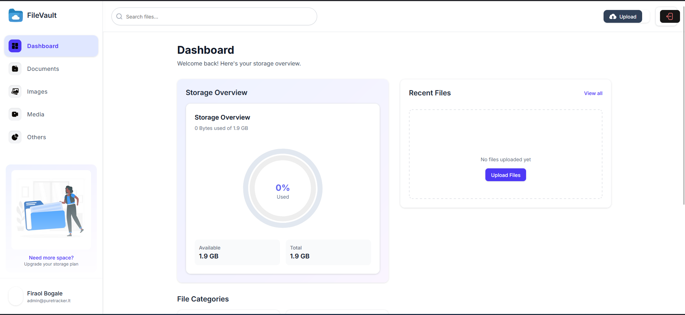

# CloudSync

<!-- Insert project image below -->



## Table of Contents

- [About](#about)
- [Features](#features)
- [Getting Started](#getting-started)
- [Installation](#installation)
- [Usage](#usage)
- [Configuration](#configuration)
- [Project Structure](#project-structure)
- [Contributing](#contributing)
- [License](#license)
- [Contact](#contact)

## About

CloudSync is a [brief description of your project]. This project aims to [state the main goal or purpose]. It is built using Next.js, React, aws etc.

## Features

- Feature 1: Manage all your files in one place
- Feature 2: Upload, download, delete, and rename files easily
- Feature 3: Seamless integration with cloud storage providers
- Feature 4: User-friendly interface for efficient file management
- Feature 5: Secure and reliable file operations

## Getting Started

These instructions will help you set up and run the project on your local machine for development and testing purposes.

### Prerequisites

- [Node.js](https://nodejs.org/)
- [npm](https://www.npmjs.com/) or [yarn](https://yarnpkg.com/)

### Installation

1. Clone the repository:

```bash
git clone https://github.com/fraolb1/cloudsync.git
cd cloudsync
```

2. Install dependencies:

```bash
npm install
# or
yarn install
```

## Usage

To start the development server:

```bash
npm run dev
# or
yarn dev
```

Open [http://localhost:3000](http://localhost:3000)

## Configuration

- The project uses a `.env` file for environment variables. You can find an example in `.env.example`:
  ```env
  AUTH_SECRET=
  AUTH_GOOGLE_ID=
  AUTH_GOOGLE_SECRET=
  NEXT_PUBLIC_BASE_URL=
  DATABASE_URL=
  AWS_ACCESS_KEY_ID=
  AWS_SECRET_ACCESS_KEY=
  AWS_REGION=
  AWS_S3_BUCKET=
  ```
- Copy `.env.example` to `.env` and fill in the required values for your environment.
- `DATABASE_URL` is required for database access (see Prisma docs for format). AWS variables are needed for S3 integration. Auth variables are for authentication providers.
- Never commit your `.env` file with secrets to version control.

## Project Structure

```
cloudsync/
├── components/
├── app/
├── public/
├── ...
```

- **components/**: Reusable React components
- **pages/**: Next.js pages/routes
- **public/**: Static assets
- **styles/**: CSS/SCSS files

## Contributing

Contributions are welcome! Please open an issue or submit a pull request.

1. Fork the repository
2. Create your feature branch (`git checkout -b feature/YourFeature`)
3. Commit your changes (`git commit -m 'Add some feature'`)
4. Push to the branch (`git push origin feature/YourFeature`)
5. Open a pull request

## License

This project is licensed under the [MIT License](LICENSE).

## Contact

For questions or feedback, please contact firaolbogala98@gmail.com.
